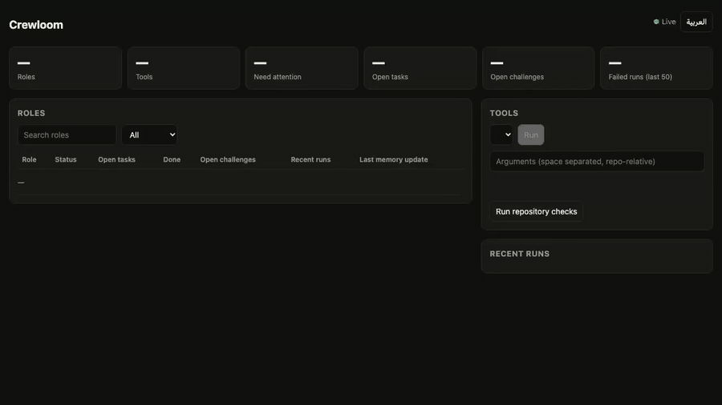

<p align="center"></p>

<p align="center">
<a href="https://github.com/elbayoumi/crewloom/actions/workflows/ci.yml"></a>
<a href="LICENSE"></a>

</p>

<p align="center"><a href="README.ar.md">العربية</a> · <a href="documentation/SKILLS.md">42 roles</a> · <a href="documentation/TOOLS.md">Tool catalog</a> · <a href="examples/README.md">Run examples</a> · <a href="CONTRIBUTING.md">Contribute</a></p>

Crewloom is a repository-native toolkit for specialist AI agent work. Choose a role, give it your project inputs, keep working memory, and check the result with local tools. Use your existing agent host and model.

The toolkit brings together **42 English role guides**, **150 detailed reference documents**, **18 catalogued Python tools**, and **five memory templates per role**. English is the primary entry point; detailed source playbooks include Arabic. Context packs and task instructions support English or Arabic.

Managed workflows add project and checkout identities, frozen context, isolated Docker acceptance, credential-scoped review, and concurrent task worktrees. [Native lifecycle setup](documentation/HOST_LIFECYCLE.md) connects supported host callbacks; [agency readiness](documentation/READINESS.md) reports client evidence without modifying client projects. See [enforcement boundaries](documentation/ENFORCEMENT.md) for what each execution path actually covers.

## Execute a software workflow

Run a six-stage feature with actual commands, project-bound evidence and resumable state:

```bash
docker pull python:3.14-slim
cp -R examples/software-workflow/project /tmp/crewloom-demo
python3 scripts/crewloom.py workflow doctor
python3 scripts/crewloom.py workflow run --project /tmp/crewloom-demo
python3 scripts/crewloom.py workflow handoff --project /tmp/crewloom-demo
```

Use a fresh destination. Commands run inside Docker with network access disabled and only the selected project mounted. The example tests a supplied Unicode implementation in English and Arabic; it demonstrates execution, not model-generated feature quality.

For real model-generated source, run the [bounded model workflow](examples/model-workflow/README.md) with Codex or Claude and verify it in Docker. Compare repeated submissions with the [provider-trial harness](examples/evaluation/unicode-slug/HOST_TRIALS.md).

For a complete application with parallel billing and planning tasks, dependency-aware integration,
English and Arabic reports, and credential-reviewed publication, run the
[concurrent development example](documentation/DEVELOPMENT_EXAMPLE.md). Its acceptance uses real
worktrees and Docker; the automated regression suite substitutes only provider generation.
The [controlled context study](documentation/CONTEXT_STUDY.md) measures input tokens, cache usage,
latency and held-out correctness separately. Missing provider metrics remain unknown.

Use the [software task plan](workflows/software-feature.json) for agent-produced work. Read [execution and failure handling](documentation/EXECUTION.md), [host setup](documentation/HOSTS.md), and [objective evaluation](examples/evaluation/unicode-slug/README.md).

## Try local checks in a minute

Requires Git and Python 3.9+. The Python core uses the standard library; isolated workflows additionally require Docker.

```bash
git clone https://github.com/elbayoumi/crewloom.git
cd crewloom
python3 scripts/crewloom.py tools
python3 scripts/crewloom.py run workflow-contract -- examples/workflows/valid.json
python3 scripts/crewloom.py run seo-packet -- --packet examples/seo/article-packet.json
```

Both example checks print `PASS`. See [six runnable examples](examples/README.md), including MCP configuration, spend pacing, video timing, and responsive grids.

## What can I do with it?

| Work | Start with | Concrete output |
| --- | --- | --- |
| Build a product feature | [Full-stack engineer](.agents/skills/fullstack-mvp-engineer/SKILL.md) + [QA](.agents/skills/qa-test-automation-engineer/SKILL.md) | Implementation and a delivery evidence packet |
| Review a frontend | [UI auditor](.agents/skills/frontend-ux-auditor/SKILL.md) | Source findings, grid checks, and supplied layout evidence |
| Prepare organic content | [SEO engineer](.agents/skills/seo-growth-engineer/SKILL.md) | Article brief and checked metadata packet |
| Produce a short video | [Script architect](.agents/skills/video-script-architect/SKILL.md) + [Studio director](.agents/skills/studio-director/SKILL.md) | Beat sheet, pacing measurement, and production handoff |
| Review automation | [Automation operations](.agents/skills/automation-ops-engineer/SKILL.md) | Checked n8n export and operational handoff |
| Coordinate project work | [Context guardian](.agents/skills/context-guardian/SKILL.md) | Bounded context pack and updated project memory |

## Use it in your project

```bash
pip install -e .            # from the clone; adds the `crewloom` command
crewloom install --host claude --target /path/to/your/project --skill frontend-ux-auditor
```

`--host claude` copies roles to `.claude/skills`; `--host agents` copies them to `.agents/skills` for hosts that read that folder (omit `--skill` for all 42). Existing roles are never overwritten without `--force`. Copied roles are static: re-run the command after pulling updates. A normal `pip install .` builds a local wheel with the Python runtime, role resources, adapters and examples. The editable command above keeps a development link to the clone. The optional Node dashboard runs from a source checkout.

## Live dashboard

```bash
crewloom dashboard          # needs Node 20+; opens on http://localhost:4317
```



Monitor roles, memory, and tool runs live with the optional [web dashboard](dashboard/README.md) ([MP4 version](assets/dashboard-demo.mp4)). `crewloom dashboard` opens on `127.0.0.1` without a password. Local request and Origin checks remain active; non-loopback hosting requires an explicitly configured `CREWLOOM_DASHBOARD_TOKEN`.

See [evidence from real projects](documentation/EVIDENCE.md), including a false positive.

Follow the [workflow recipes](documentation/WORKFLOWS.md) for role order, inputs, and acceptance evidence. Roles guide your agent; specialist platforms and project assets remain project inputs.

## Give your agent a task

Open the checkout in your agent host. Start with a specific role and outcome:

> Read AGENTS.md and the frontend-ux-auditor skill, including its references and brain. Use English. Review my project's responsive layout, run the applicable local checks, and report findings with file locations and evidence. Update working memory when finished.

> اقرأ AGENTS.md ومهارة frontend-ux-auditor ومراجعها والبرين. استخدم العربية. راجع تجاوب واجهة مشروعي، وشغّل الفحوص المحلية المناسبة، واعرض المشاكل بمواقع الملفات والأدلة. حدّث الذاكرة بعد الانتهاء.

```bash
python3 scripts/crewloom.py show frontend-ux-auditor
python3 scripts/crewloom.py context frontend-ux-auditor --language en --out /tmp/crewloom-en.md
python3 scripts/crewloom.py context frontend-ux-auditor --language ar --out /tmp/crewloom-ar.md
```

## Inside the repository

| Location | Contents |
| --- | --- |
| [.agents/skills](.agents/skills) | Role guides, detailed playbooks, architecture references, memory, and tools |
| [documentation](documentation) | Setup, architecture, workflows, tool contracts, and release evidence |
| [examples](examples) | Synthetic inputs with runnable commands and expected results |
| [Brain](Brain) | Shared architecture, decisions, challenges, ideas, and roadmap |
| [scripts](scripts) | CLI and repository validation |
| [.github/workflows](.github/workflows) | Python 3.9 and 3.14 CI checks |

## How checks work

Run the repository gate locally; enable the same gate before commits:

```bash
git config core.hooksPath .githooks
python3 scripts/check_repository.py
```

Checks cover role structure, Python syntax, Markdown links, and regression suites. Domain tools inspect the inputs documented in the [tool catalog](documentation/TOOLS.md). Static findings and evidence bookkeeping do not establish rendered UI quality or the truth of supplied evidence.

Crewloom does not include a hosted orchestration server or a model provider. It is distributed as a Git repository; no npm or PyPI package is published. See [project inputs and boundaries](documentation/PROJECT_INPUTS.md).

## Documentation and contribution

Start with [Getting started](documentation/GETTING_STARTED.md), [Architecture](documentation/ARCHITECTURE.md), and [Workflow recipes](documentation/WORKFLOWS.md). Read [Contributing](CONTRIBUTING.md), [Security](SECURITY.md), and [the changelog](CHANGELOG.md) before proposing changes.

Derived from RUMUZE Agency's first-party procedures, with clean public memory and filtered operational references. Client records, private infrastructure, and internal history are excluded. See [provenance](documentation/PROVENANCE.json).

[Apache-2.0](LICENSE) · Copyright 2026 RUMUZE Agency · [Attribution](NOTICE).

Project selection and isolation: [project guide](documentation/PROJECTS.md).

## Self-Editing Mode

Use [Self-Editing Mode](documentation/SELF_EDITING.md) to repair an existing role, tool or document from an observed problem. The workflow binds a project, makes an in-place change, verifies acceptance and records the result. Arabic activation name: **التعديل الذاتي**.

Managed execution now rejects native model CLI steps by default. See [enforcement and compatibility](documentation/ENFORCEMENT.md) before running an existing model plan.

[Context efficiency](documentation/CONTEXT_EFFICIENCY.md) selects relevant historical records while keeping rules and inputs complete, and verifies context hashes before reusing completed model work.

[Project repository maps](documentation/REPOSITORY_MAP.md) provide a bounded file/symbol index with project-local parsing reuse: `crewloom map --project /path/to/git-project --query login`.

[Project context](documentation/PROJECT_CONTEXT.md) is opt-in per project and adds a portable project ID, a local checkout binding, a frozen per-task context with hash-validated code ranges, and lessons that only recorded executor evidence can promote.

```bash
crewloom project enter  --project /path/to/your/project --project-id sample-project --task-id login-fix --role context-guardian --seed src/auth.py
crewloom project status --project /path/to/your/project --project-id sample-project
crewloom project finish --project /path/to/your/project --project-id sample-project --task-id login-fix --evidence '[{"workflow": "login-flow", "step": "acceptance", "scope": "unit tests"}]'
```

Entry creates missing metadata and refreshes existing ones without rewriting your constitution or role memory. `status` reports whether the lifecycle is managed by the Crewloom runner, instruction-assisted or manual; opening a folder never triggers it by itself. `finish` completes a task only from recorded executor evidence; `--verification` records an operator attestation and keeps the task awaiting verification. See [the pilot](documentation/PROJECT_CONTEXT.md#measurements) for measured cold/warm behaviour.

## Run independent tasks concurrently

Independent tasks in one project run as a batch instead of one after another. Each task gets its own Git worktree under the project's `.crewloom`, runs the same isolated Docker executor, and a dependent task reads its ancestors' committed output:

```bash
crewloom coordinator validate --project /path/to/your/project --project-id sample-project --manifest coordinator.json
crewloom coordinator run      --project /path/to/your/project --project-id sample-project --manifest coordinator.json
crewloom coordinator prepare  --project /path/to/your/project --project-id sample-project --manifest coordinator.json
```

The checked-out tree changes only after an explicit reviewed decision moves it by one recorded fast-forward. See [the coordinator](documentation/COORDINATOR.md) and its [Arabic guide](documentation/COORDINATOR.ar.md).

## Schedule projects and monitor admission

Queue explicit registered projects by priority, keep one batch per root, and share managed-generation allowances across worktrees. The dashboard shows project-local tool activity, role failures, queue status, and unknown cost without treating it as zero.

See [scheduling and shared budgets](documentation/SCHEDULING_AND_BUDGETS.md) for setup, crash recovery, and the distinction between admission allowances and vendor billing limits. The queue preserves the existing review step before publication.

See the [Arabic/English developer pilot](examples/bilingual-evaluation/README.md) for the actual generated code, 40 held-out cases, passing Codex trials, and preserved provider failures. Cross-provider evaluation remains incomplete.

[Source-linked user context](documentation/USER_CONTEXT.md) adds project-local quoted statements, labelled assumptions and explicit task interpretations to frozen model context. Corrections retain history; changed sources invalidate reuse. This is provenance checking, not proof of speaker identity or model accuracy.
